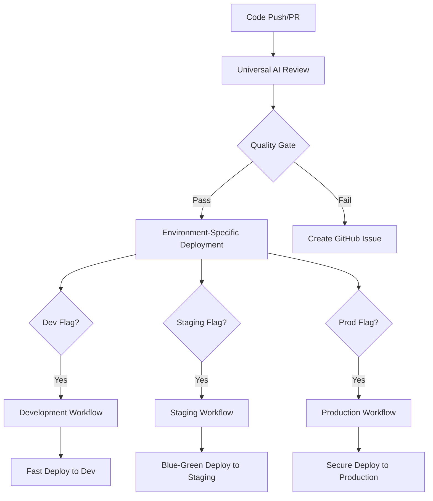

# 🚀 Deployment Workflows Guide

## 🏷️ Commit Flag-Based Deployments

Use these flags in your commit messages to trigger specific deployments:

### Development Deployment
```bash
git commit -m "[dev] Add new feature for development testing"
```
- **Target**: Development environment
- **Requirements**: Quality ≥ 60, Security ≥ 70
- **Features**: Fast build, basic testing, development optimizations

### Staging Deployment  
```bash
git commit -m "[staging] Prepare feature for staging validation"
```
- **Target**: Staging environment  
- **Requirements**: Quality ≥ 75, Security ≥ 80
- **Features**: Full testing, blue-green deployment, integration tests

### Production Deployment
```bash
git commit -m "[prod] Deploy critical fix to production"
```
- **Target**: Production environment
- **Requirements**: Quality ≥ 85, Security ≥ 90
- **Features**: Maximum security, SLSA attestations, manual approval, rollback capability

## 🤖 AI Code Review System

### Universal Review (Every Push/PR)
- **Triggers**: All pushes and pull requests
- **Actions**: 
  - Code quality analysis
  - Security scanning
  - Performance metrics
  - Creates GitHub issues for quality problems
  - Determines deployment eligibility

### Pull Request Review (PR Only)
- **Triggers**: Pull requests only
- **Actions**:
  - Detailed AI analysis
  - Advanced security scanning
  - Quality gate decisions
  - PR comments with recommendations

## 🔄 Workflow Architecture



## 📊 Quality Requirements

| Environment | Quality Score | Security Score | Additional Requirements |
|-------------|---------------|----------------|------------------------|
| Development | ≥ 60          | ≥ 70           | Basic tests pass |
| Staging     | ≥ 75          | ≥ 80           | Full test suite, integration tests |
| Production  | ≥ 85          | ≥ 90           | Security scan, manual approval, SLSA attestations |

## 🛠️ Workflow Features

### Development Workflow (`deploy-development.yml`)
- ⚡ **Fast execution** (20 min timeout)
- 📦 **Aggressive caching** for dependencies and builds
- 🔨 **Development builds** with source maps
- 🧪 **Basic health checks**
- 🏗️ **Attestations** for security compliance

### Staging Workflow (`deploy-staging.yml`)
- 🧪 **Enhanced testing** including integration tests
- 🔄 **Blue-green deployment** for zero downtime
- 📊 **Performance baseline** validation
- 🔒 **SLSA attestations** and SBOM generation
- 📈 **Comprehensive health checks**

### Production Workflow (`deploy-production.yml`)
- 🔒 **Maximum security** with enhanced validation
- 👥 **Manual approval** gate (optional)
- 💾 **Automatic backup** before deployment
- 🔄 **Blue-green deployment** with health validation
- 🔙 **Automatic rollback** on failure
- 📈 **Performance and load testing**
- 🏗️ **Full attestation suite** (SLSA, SBOM, signing)

## 🎯 Best Practices

### Commit Message Examples
```bash
# Development testing
git commit -m "[dev] Fix API endpoint validation logic"

# Staging preparation  
git commit -m "[staging] Add user authentication module - ready for UAT"

# Production deployment
git commit -m "[prod] Critical security patch for user authentication"

# Multiple environments (use sparingly)
git commit -m "[dev][staging] Update API documentation and tests"

# Code review only (no deployment)
git commit -m "Refactor utility functions for better maintainability"
```

### Quality Guidelines
1. **Always run tests locally** before pushing
2. **Use semantic commit messages** that clearly describe changes
3. **Keep commits focused** and atomic
4. **Include relevant tests** for new features
5. **Update documentation** for public APIs
6. **Follow security best practices** in all environments

### Emergency Procedures
1. **Production issues**: Use GitHub issues created by failed deployments
2. **Rollback**: Triggered automatically on deployment failure
3. **Hotfixes**: Use `[prod]` flag with minimal, focused changes
4. **Emergency contact**: Check deployment summary for relevant links

## 📈 Monitoring and Alerts

- **GitHub Issues**: Automatically created for quality/security problems
- **Deployment Summaries**: Detailed reports in GitHub Actions
- **Health Checks**: Continuous monitoring post-deployment
- **Performance Metrics**: Response time and load testing results

## 🔧 Configuration

All workflows use:
- **OIDC authentication** for Azure (no secrets in logs)
- **GitHub Container Registry** (GHCR) for container images
- **Bicep templates** for infrastructure as code
- **Caching strategies** for fast builds
- **Attestations and signing** for supply chain security
